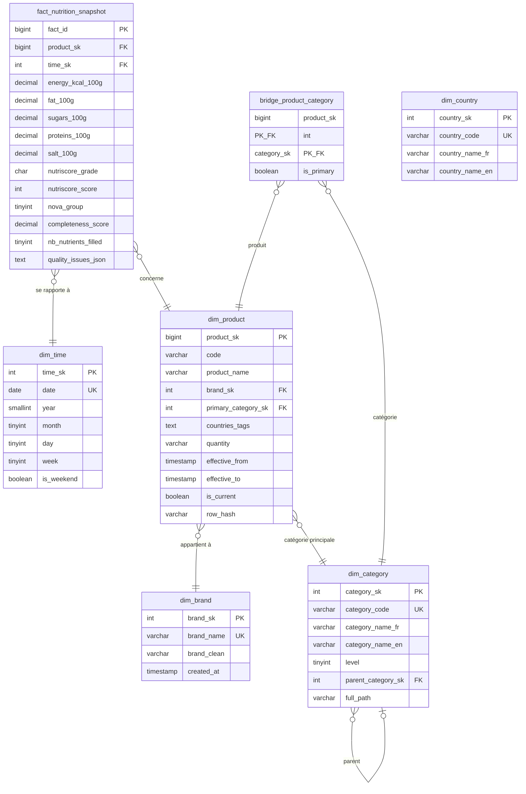

# Schéma du Datamart - OpenFoodFacts

## Table des matières

1. [Vue d'ensemble](#vue-densemble)
2. [Modèle en étoile (Star Schema)](#modèle-en-étoile-star-schema)
3. [Diagramme ER](#diagramme-er)
4. [Cardinalités](#cardinalités)
5. [Exemple de requête](#exemple-de-requête)

---

## Vue d'ensemble

Le datamart OpenFoodFacts est organisé selon un **modèle en étoile** (star schema) optimisé pour les requêtes analytiques OLAP.

### Caractéristiques

- **1 table de faits** : `fact_nutrition_snapshot`
- **5 dimensions** : `dim_time`, `dim_brand`, `dim_category`, `dim_country`, `dim_product`
- **1 bridge table** : `bridge_product_category` (relation N-N)
- **Granularité** : Un snapshot nutritionnel par produit et par date

---

## Modèle en étoile (Star Schema)

### Diagramme ASCII

```
                     ┌──────────────┐
                     │   dim_time   │
                     │──────────────│
                     │  time_sk PK  │
                     │  date        │
                     │  year, month │
                     │  week        │
                     └──────┬───────┘
                            │
                            │ 1
         ┌──────────────────┼─────────────────────┐
         │                  │                     │
         │ N                │ N                   │ 1
    ┌────▼──────┐   ┌───────▼───────────────┐ ┌──▼───────────┐
    │ dim_brand │   │ fact_nutrition_       │ │ dim_category │
    │───────────│   │     snapshot          │ │──────────────│
    │brand_sk PK│◄──┤────────────────────   │─►│category_sk PK│
    │brand_name │ N │ fact_id PK            │1 │category_code │
    └───────────┘   │ product_sk FK ─────┐  │  │level         │
                    │ time_sk FK         │  │  │parent_sk FK  │
    ┌───────────┐   │ energy_kcal_100g   │  │  └──────────────┘
    │dim_country│   │ fat_100g           │  │
    │───────────│   │ sugars_100g        │  │  ┌──────────────┐
    │country_sk │   │ proteins_100g      │  │  │ dim_product  │
    │     PK    │   │ nutriscore_grade   │  │  │──────────────│
    │country_   │   │ completeness_score │  └─►│ product_sk PK│
    │  code     │   │ quality_issues_json│  1  │ code (EAN)   │
    └───────────┘   └────────────────────┘     │ product_name │
                                                │ brand_sk FK  │
                                                │ category_sk  │
                    ┌─────────────────────┐    │ effective_from│
                    │ bridge_product_     │    │ effective_to │
                    │     category        │    │ is_current   │
                    │─────────────────────│    └──────┬───────┘
                    │ product_sk PK,FK  ──┼───────────┘
                    │ category_sk PK,FK ──┼────┐
                    │ is_primary          │    │
                    └─────────────────────┘    │
                                               │
                              ┌────────────────┘
                              │
                       ┌──────▼───────┐
                       │ dim_category │
                       │──────────────│
                       │category_sk PK│
                       └──────────────┘
```

---

## Diagramme ER (Mermaid)



---

## Cardinalités

### Relations dimension → fait

| Dimension | Cardinalité | Fait |
|-----------|-------------|------|
| `dim_time` | 1 → N | `fact_nutrition_snapshot` |
| `dim_product` | 1 → N | `fact_nutrition_snapshot` |

**Exemple :**
- Une date (`time_sk=5`) peut avoir plusieurs faits nutritionnels (N produits modifiés ce jour-là)
- Un produit (`product_sk=1`) peut avoir plusieurs faits (évolution dans le temps)

### Relations dimension → dimension

| Dimension enfant | Cardinalité | Dimension parent |
|------------------|-------------|------------------|
| `dim_product` | N → 1 | `dim_brand` |
| `dim_product` | N → 1 | `dim_category` |
| `dim_category` | N → 0..1 | `dim_category` (parent) |

**Exemple :**
- Plusieurs produits peuvent appartenir à la marque "Carrefour"
- Une catégorie peut avoir une catégorie parente (hiérarchie)

### Relation N-N (bridge table)

| Table | Cardinalité | Table |
|-------|-------------|-------|
| `dim_product` | N → N | `dim_category` |

**Via :** `bridge_product_category`

**Exemple :**
- Un yaourt peut appartenir à : "Produits laitiers", "Yaourts", "Bio"
- La catégorie "Bio" contient des yaourts, fromages, légumes, etc.

---

## Détails des tables

### fact_nutrition_snapshot (table de faits)

**Clés :**
- `fact_id` : Clé primaire (surrogate)
- `product_sk` : FK vers `dim_product`
- `time_sk` : FK vers `dim_time`

**Mesures (17 colonnes) :**
- **Nutriments** : energy, fat, carbohydrates, sugars, proteins, salt, sodium, fiber
- **Scores** : nutriscore_grade, nutriscore_score, nova_group, ecoscore_grade
- **Qualité** : completeness_score, nb_nutrients_filled, has_image, has_ingredients
- **Anomalies** : quality_issues_json

**Type de fait :**
- **Snapshot** (photo à un instant T)
- **Granularité** : Produit × Date
- **Additivité** : Non-additive (moyennes, médianes)

### dim_product (dimension)

**Type de dimension :**
- **SCD Type 2** (Slowly Changing Dimension)
- Historisation des changements (effective_from, effective_to, is_current)

**Colonnes clés :**
- `product_sk` : Clé surrogate (technique)
- `code` : Clé naturelle (code-barres EAN)
- `is_current` : TRUE pour la version active

**Exemple d'historisation :**
```
Code 3274080005003 (Lait Carrefour)

Version 1 (ancienne) :
  product_sk=100, product_name="Lait", effective_from=2023-01-01,
  effective_to=2024-06-15, is_current=FALSE

Version 2 (actuelle) :
  product_sk=200, product_name="Lait BIO", effective_from=2024-06-16,
  effective_to=NULL, is_current=TRUE
```

### dim_time (dimension)

**Type de dimension :**
- **Dimension de référence** (préchargée)
- Contient toutes les dates nécessaires

**Colonnes dérivées :**
- `year`, `month`, `day` : Composantes de la date
- `week` : Semaine ISO (1-53)
- `quarter` : Trimestre (1-4)
- `day_of_week` : Jour de la semaine (1=dimanche)
- `is_weekend` : Booléen (samedi/dimanche)

**Usage :**
- Analyses temporelles (trends, évolutions)
- Filtres par période (mois, trimestre, année)

### dim_brand (dimension)

**Type de dimension :**
- **Dimension de type 1** (pas d'historisation)
- Une marque ne change jamais de nom

**Déduplication :**
- Normalisation Unicode : "Nestlé" et "Nestle" fusionnés
- Lowercase pour comparaison : "CARREFOUR" → "carrefour"

### dim_category (dimension)

**Type de dimension :**
- **Hiérarchique** (parent-child)
- Auto-référence via `parent_category_sk`

**Hiérarchie (exemple) :**
```
en:foods (sk=1, parent=NULL, level=1)
└─ en:beverages (sk=2, parent=1, level=2)
   ├─ en:plant-based-beverages (sk=3, parent=2, level=3)
   │  └─ en:plant-based-milk (sk=4, parent=3, level=4)
   └─ en:alcoholic-beverages (sk=5, parent=2, level=3)
```

**Requête récursive (CTE) :**
```sql
WITH RECURSIVE category_hierarchy AS (
  -- Niveau racine
  SELECT
    category_sk,
    category_code,
    parent_category_sk,
    1 as depth,
    category_code as path
  FROM dim_category
  WHERE parent_category_sk IS NULL

  UNION ALL

  -- Niveaux suivants
  SELECT
    c.category_sk,
    c.category_code,
    c.parent_category_sk,
    h.depth + 1,
    CONCAT(h.path, '/', c.category_code)
  FROM dim_category c
  JOIN category_hierarchy h ON c.parent_category_sk = h.category_sk
)
SELECT * FROM category_hierarchy;
```

### bridge_product_category (bridge table)

**Type de table :**
- **Table de liaison** (many-to-many)
- Résout la relation N-N entre produits et catégories

**Clé primaire composée :**
```sql
PRIMARY KEY (product_sk, category_sk)
```

**Exemple de données :**
```
Produit "Yaourt fraise BIO" (product_sk=100)
├─ en:dairies (category_sk=10, is_primary=TRUE)
├─ en:yogurts (category_sk=25, is_primary=FALSE)
├─ en:fermented-milk (category_sk=30, is_primary=FALSE)
└─ en:organic (category_sk=50, is_primary=FALSE)
```

**Requête d'utilisation :**
```sql
-- Tous les produits de la catégorie "Bio"
SELECT p.*
FROM dim_product p
JOIN bridge_product_category b ON p.product_sk = b.product_sk
JOIN dim_category c ON b.category_sk = c.category_sk
WHERE c.category_code = 'en:organic';
```

---

## Exemple de requête analytique

### Question métier

**"Quelle est la moyenne de sucres par catégorie de produits pour les marques françaises ?"**

### Requête SQL

```sql
SELECT
    c.category_name_fr AS categorie,
    b.brand_name AS marque,
    COUNT(*) AS nb_produits,
    ROUND(AVG(f.sugars_100g), 2) AS avg_sucres_100g,
    ROUND(AVG(f.completeness_score), 2) AS avg_completeness
FROM fact_nutrition_snapshot f
JOIN dim_product p ON f.product_sk = p.product_sk
JOIN dim_brand b ON p.brand_sk = b.brand_sk
JOIN dim_category c ON p.primary_category_sk = c.category_sk
JOIN dim_time t ON f.time_sk = t.time_sk
WHERE f.sugars_100g IS NOT NULL
  AND t.year = 2024
  AND c.level = 1  -- Catégories de niveau 1 uniquement
GROUP BY c.category_name_fr, b.brand_name
HAVING COUNT(*) >= 5  -- Au moins 5 produits
ORDER BY avg_sucres_100g DESC
LIMIT 20;
```

### Plan d'exécution (optimisé)

```
1. SCAN dim_time → Filtre year=2024 → ~365 lignes
2. SCAN fact_nutrition_snapshot → Filtre sugars IS NOT NULL → ~35k lignes
3. JOIN fact ↔ dim_time (FK time_sk) → ~35k lignes
4. JOIN fact ↔ dim_product (FK product_sk) → ~35k lignes
5. JOIN product ↔ dim_brand (FK brand_sk) → ~35k lignes
6. JOIN product ↔ dim_category (FK category_sk) → ~35k lignes
7. GROUP BY category, brand → ~200 groupes
8. HAVING COUNT >= 5 → ~150 groupes
9. ORDER BY avg_sucres DESC → Tri
10. LIMIT 20 → 20 lignes finales
```

**Temps d'exécution estimé :** < 0.5 seconde (avec index)

### Résultat exemple

```
| categorie        | marque           | nb_produits | avg_sucres_100g | avg_completeness |
|------------------|------------------|-------------|-----------------|------------------|
| Confiseries      | Haribo           | 45          | 72.5            | 0.85             |
| Boissons sucrées | Coca-Cola        | 12          | 11.2            | 0.92             |
| Yaourts          | Danone           | 38          | 9.8             | 0.88             |
| Céréales         | Kellogg's        | 22          | 25.4            | 0.90             |
```

---

## Règles de modélisation

### Principes respectés

1. **Dénormalisation des dimensions** : Colonnes redondantes (category_name_fr + category_name_en) pour éviter jointures
2. **Clés surrogates** : Clés techniques auto-incrémentées (product_sk, brand_sk)
3. **Clés naturelles conservées** : code (EAN), category_code (OFF)
4. **Granularité fine** : Snapshot par produit × date
5. **Conformité Kimball** : Star schema strict (pas de snowflake excessif)

### Violations intentionnelles

| Règle classique | Violation | Justification |
|-----------------|-----------|---------------|
| Pas de hiérarchie dans dimension | `dim_category` auto-référencée | Nécessaire pour taxonomie OFF |
| Pas de bridge table en étoile | `bridge_product_category` | Relation N-N inévitable |
| Dimension unique par FK | `dim_country` non utilisé dans fait | Stocké en JSON dans `dim_product.countries_tags` |

---

## Volumétrie

### Estimations (production complète)

| Table | Lignes (sample 30k) | Lignes (prod 500k) | Taille estimée |
|-------|---------------------|---------------------|----------------|
| `dim_time` | ~1,000 | ~1,000 | 100 KB |
| `dim_brand` | 6,304 | ~50,000 | 5 MB |
| `dim_category` | 3,148 | ~10,000 | 1 MB |
| `dim_country` | 187 | ~200 | 20 KB |
| `dim_product` | 49,999 | 500,000 | 200 MB |
| `fact_nutrition` | 49,999 | 500,000 | 300 MB |
| `bridge_product_category` | 0 (non peuplé) | 1,500,000 | 50 MB |

**Total estimé :** ~560 MB (sans index)

**Avec index :** ~800 MB

---

## Optimisations

### Index créés

```sql
-- fact_nutrition_snapshot
CREATE INDEX idx_product ON fact_nutrition_snapshot(product_sk);
CREATE INDEX idx_time ON fact_nutrition_snapshot(time_sk);
CREATE INDEX idx_nutriscore ON fact_nutrition_snapshot(nutriscore_grade);
CREATE INDEX idx_completeness ON fact_nutrition_snapshot(completeness_score);

-- dim_product
CREATE INDEX idx_code ON dim_product(code);
CREATE INDEX idx_code_current ON dim_product(code, is_current);
CREATE INDEX idx_brand ON dim_product(brand_sk);

-- dim_category
CREATE INDEX idx_level ON dim_category(level);
CREATE INDEX idx_parent ON dim_category(parent_category_sk);
```

### Statistiques

```sql
-- Mettre à jour les statistiques MariaDB
ANALYZE TABLE fact_nutrition_snapshot;
ANALYZE TABLE dim_product;
ANALYZE TABLE dim_brand;
```

### Partitionnement (future)

```sql
-- Partitionnement de la table de faits par année
ALTER TABLE fact_nutrition_snapshot
PARTITION BY RANGE (YEAR(loaded_at)) (
  PARTITION p2023 VALUES LESS THAN (2024),
  PARTITION p2024 VALUES LESS THAN (2025),
  PARTITION p2025 VALUES LESS THAN (2026),
  PARTITION p_future VALUES LESS THAN MAXVALUE
);
```

---

**Auteurs :** Félicien, Charif, Clément
**Dernière mise à jour :** 25 janvier 2026
